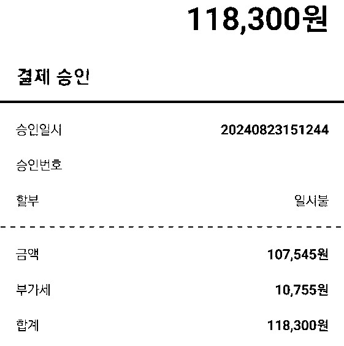

# Recolor Dark Mode Receipt

## Story

주말을 앞둔 어느 금요일 오후, 이번달 팀 회식비를 미처 다 사용하지 못한 모 부서는 마침 요거트 아이스크림을 아주 정석적으로 한다는 집이 있어 이 기회에 다 같이 먹어 보기로 하였다.

카드로 직접 결제한 후 지출 증빙을 위해 문자로 영수증을 전송받았으나, 두둥...


이게 웬 일인가! 다크 모드로 캡쳐된 이미지를 전송받았다.

아무리 개발 부서가 일반적으로 다른 부서에 비해 자유로운 복장이라든지 수평적인 호칭이라든지 일반적인 조직 생활에 비해 앞서가는 부분들이 있다지만 지출 증빙으로 사용해야 할 신성한 영수증에 다크 모드를 적용해서 제출한다면 그 결과는 불 보듯 뻔하다.

따라서, 이 영수증을 상식이 통하는 일반적인 형태(흰색 바탕에 검은 글씨)로 복원해 내야만 한다.

## Result

아이스크림이 녹아내리기 전까지 적당한 퀄리티의 결과를 얻는 데에 실패하였으며, 결국 이미지 편집 도구인 [GIMP(GNU Image Manipulation Program)](https://www.gimp.org/)를 이용하여 이미지의 색상을 적당히 조절하여 흑백으로 출력하는 것으로 마무리하였다.

아이스크림을 넉넉하게 2인분으로 주문하였으나, 3분의 1 가량이 녹아내려 토핑으로 들어 있던 벌집과 치즈케익을 촉촉하게 적셔 버렸다.

활자로 찍어낸 듯한 결과물



## P. S.

라이더 양반에게 연락해서 영수증을 다시 받는 방법이 있긴 했지만...

## Usage

### Requirements

[node](https://nodejs.org/en/download/package-manager/current)

### Steps

1. locate the image you want to convert on your local device

2. modify index.js (enclosed **[example.js](./example.js)** as reference)

```js
// index.js
const FILE_PATH = "/path/to/your/image-file";

const BACKGROUND_COLOR = [41, 49, 62]; // RGB of receipt background color
const SIMILARITY = 70; // allows 255 * (100-SIMILARITY)% of difference between pixel color and BACKGROUND_COLOR

const OUT_DIR = "/path/to/your/new-image-file";
```

3. install dependency

    npm install

4. run script

    npm run start

## Author

mule-heo